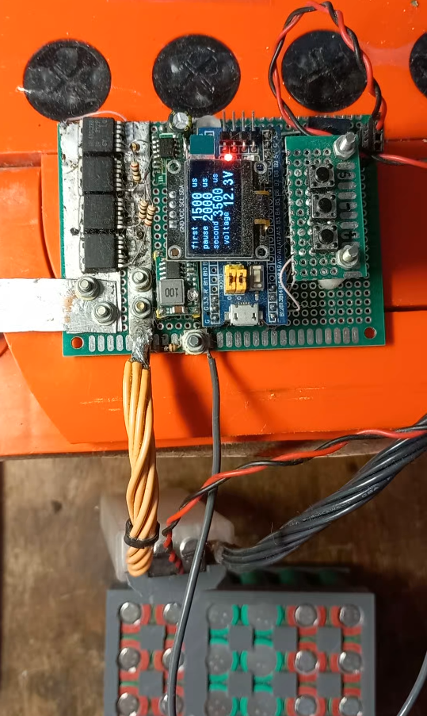
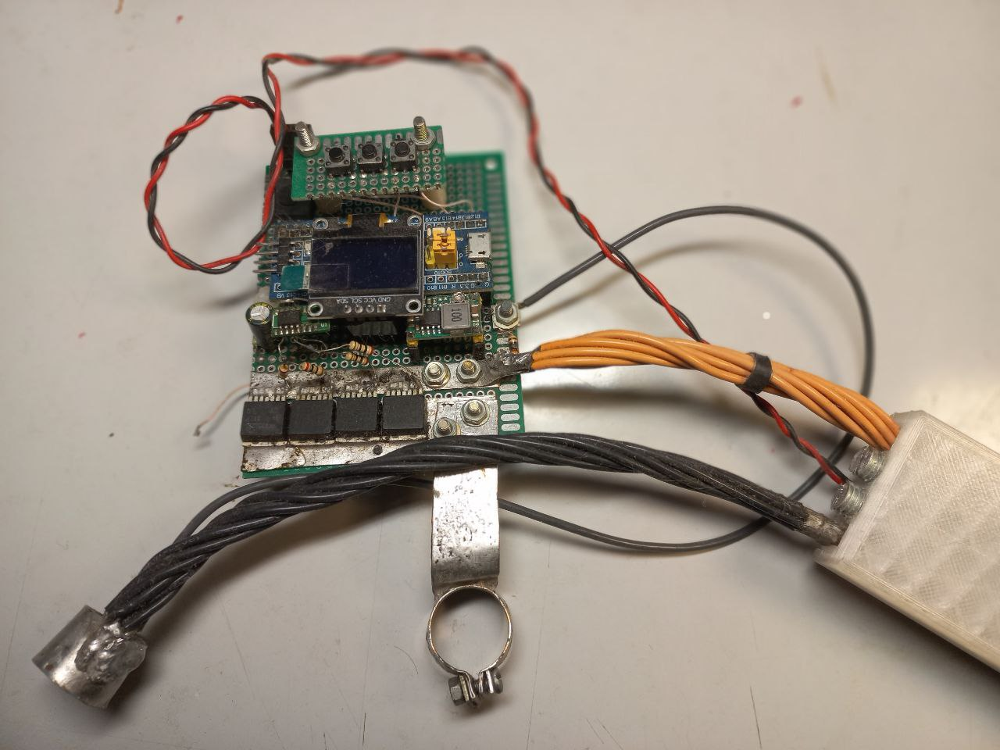

# Максимально бюджетный аппарат точечной сварки для 18650 и подобных

Полевые ключи от матринской платы по питанию процессора. OLED-дисплей 0.96". Bluepill на STM32 c алиэкспресс. 

**Архивный проект 2023 года** — аппарат точечной сварки двухимпульсный (разогрев + сварка) на базе STM32. Используется в комплекте с автомобильным аккумулятором, но подойдет любой высокотоковый 12в. Можно использовать конденсаторное питание, но я не тестировал, так как ставилась цель сотни непрерывных сварок подряд.

https://github.com/user-attachments/assets/1fbc5b3e-b446-4555-8be0-63c3d0c397dd

## Возможности

- Приваривает ленту с алиэкспресс 0.12*7мм к Li-ion аккумуляторам (18650 и др.)
- Автоматическая ручка с регулировкой прижима - гарантирует стабильное усилие на обоих электродах в момент сварки.
- Ручка автоматически подает сварочные импульсы в момент оптимального прижатия ОБОИХ электродов.
- Качество сварки без почернений, прожигов, непроваров (!!! необходимо настроить под свою ленту, так как часто не известно что у вас в руках!)
- OLED-дисплей отображает длительность двух импульсов и длительность паузы между ними и напряжение на аккумуляторе.
- Клавиатура позволяет настроить все три длительности.
- Возможности сохранить предустановки нет, при подключении к питанию берутся дефолтные значения из кода.
- Работает на STM32F103 (Blue Pill / Black Pill и т.п.)
- ВНИМАНИЕ!!! настройка длительностей более 10-15 миллисекунд приводит к выгоранию полевых ключей !!!

## Фото устройства

  
*Собранное устройство (вид сверху)*

  
*Собранное устройство (общий вид)*

## Фото автоматической сварочной ручки

  
*Сварочная ручка*

## Электрическая схема

  
*Полная электрическая схема*

Подробные файлы схемы:  
- (в планах) ~~[KiCad проект → schematic.kicad_sch](hardware/schematics/)~~
- (в планах) ~~[Экспорт в PDF → schematic.pdf](hardware/schematics/schematic.pdf)~~

## Как открыть и собрать проект

1. Установи **STM32CubeIDE** (изначально создавался в 1.4, позже компилировался в версии 1.7)
2. File → Open Projects from File System... → укажи корень репозитория
3. Открой файл `*.ioc` в STM32CubeMX (если нужно изменить пины/настройки)
4. Project → Build All
5. Подключи ST-Link / USB → Run / Debug

**Прошивка без IDE** (опционально):  
Используй `*.hex` / `*.bin` из папки Release/Debug + STM32CubeProgrammer или dfu-util. (в репо не залиты, это сообщение оставлено для памяти)

## Как использовать

1. Подключи устройство к аккумулятору
2. При первых пробах подбери длительности по качеству сварки: провар должен быть 100% надежный, без прогаров, без почернений. !!! НЕ УВЛЕКАЙСЯ большими длительностями (max 10 миллисекунд) !!! 
3. ВАЖНО! - Перед использованием ленту необходимо подготовить - сделать продольные прорезы между точками сварки, на концах ножницами, в серединках - дримером (бормашинкой) с алмазным диском. БЕЗ прорезов качество становится неконтролируемым и требуются токи, не совместимые с дешевыми полевыми ключами !!! (я вообще использовал ключи, снятые с мертвых материнских плат по питанию процессора)
4. ВАЖНО обсепечить чистые поверхности, без мусора, между лентой и аккумулятором для обеспечения надежного контакта для прохождения сварочного тока.

## Зависимости / Требования

- STM32CubeIDE / STM32CubeMX
- STM32F103C8/R8 серия bluepill

## Disclaimer

Проект старый, не поддерживается.  
Это рабочий отлаженный прототип. Но возможен апгрейд проекта (например добавить запоминание настроек, настройка с телефона по блютуз, сбор статистики и др.) при обоюдовыгодном интересе.

Используй на свой страх и риск.  
Сообщения об ошибках / PR приветствуются!

## Лицензия

MIT License — см. файл [LICENSE](LICENSE)

## Контакты

Если хотите со мной связаться: телега @khasuist
